# Marketplace App

A React Native e-commerce application built with Expo SDK 56, Redux Toolkit, and RTK Query. Features a clean feature-based architecture with full support for Light and Dark themes.

| | |
|---|---|
| 📂 GitHub | https://github.com/Kishan89/Marketplace-App |
| 📦 APK | [Download (Google Drive)](https://drive.google.com/file/d/1UDgyofpIESEFHjTTCMUURIKNgc8XEDs9/view?usp=drive_link) |
| 🎥 Demo Video | [Watch (Google Drive)](https://drive.google.com/file/d/1wmCiRpn0CO9CiiP-xwvEHetxuD4IwUmG/view?usp=sharing) |

---

## 📱 Screenshots

### ☀️ Light Mode

<p align="center">
  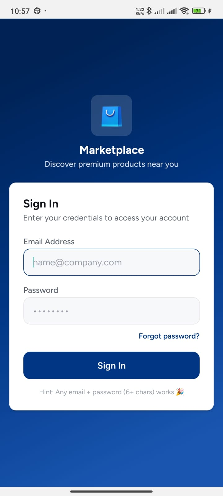
  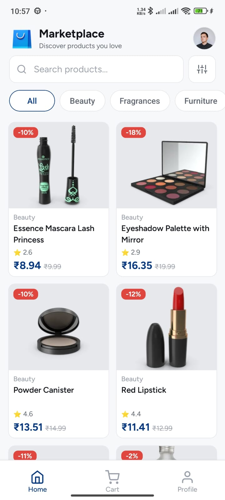
  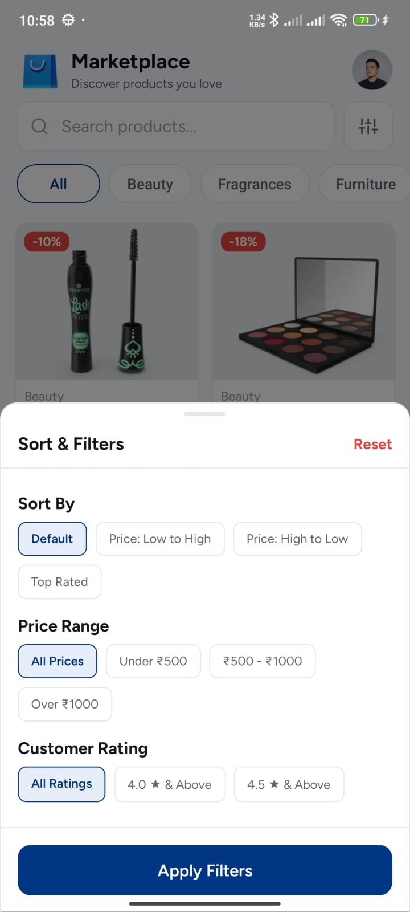
  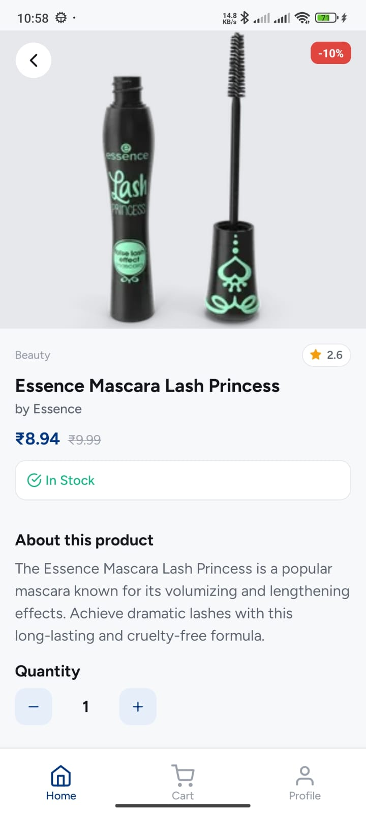
  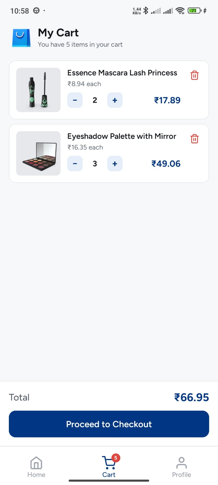
</p>

<p align="center">
  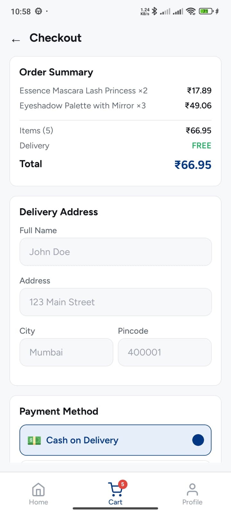
  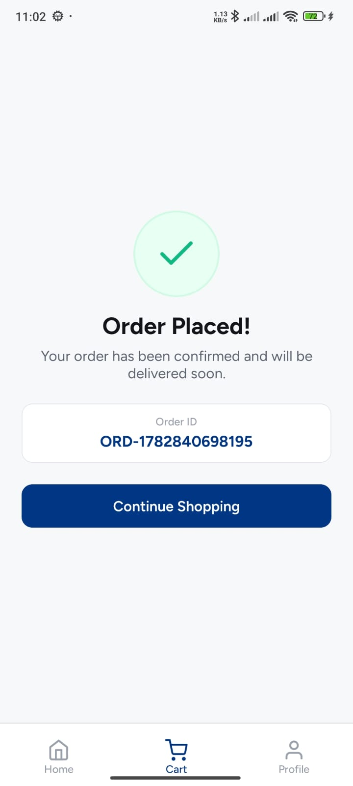
  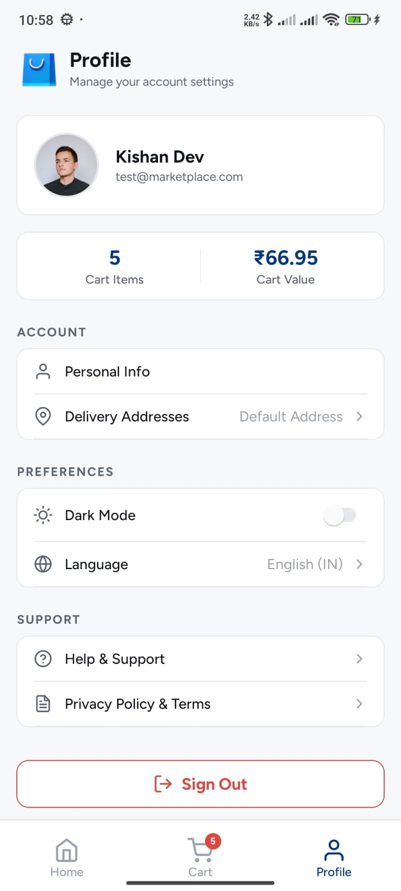
</p>

### 🌙 Dark Mode

<p align="center">
  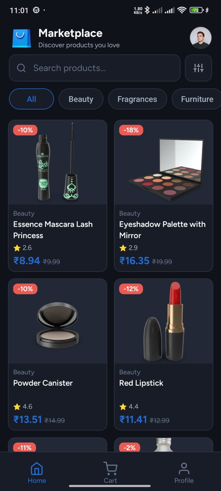
  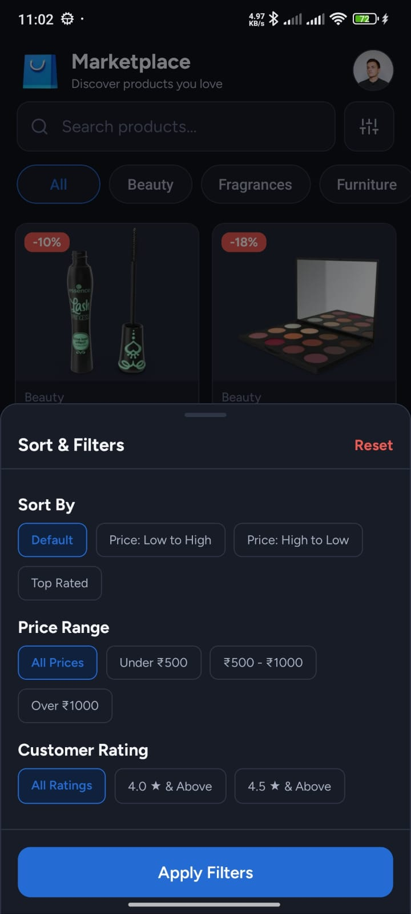
  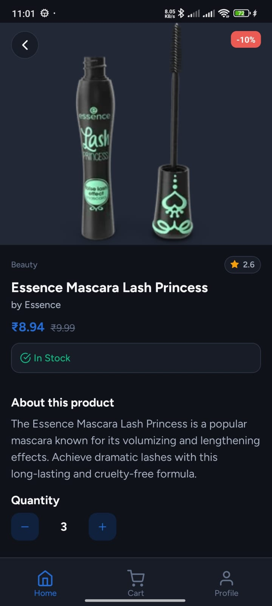
  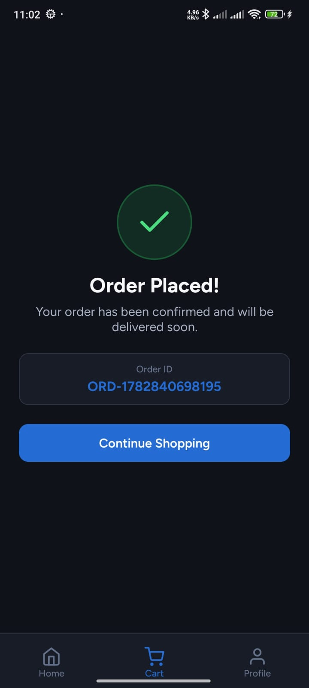
  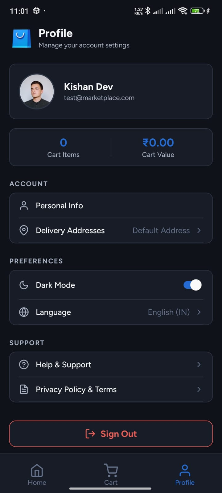
</p>

---

## 🛠️ Tech Stack

| Category | Library |
|---|---|
| Framework | React Native + Expo SDK 56 |
| State Management | Redux Toolkit |
| Data Fetching | RTK Query (DummyJSON API) |
| Navigation | React Navigation (Native Stack + Bottom Tabs) |
| Forms & Validation | React Hook Form + Zod |
| Icons | @expo/vector-icons (Feather, FontAwesome) |
| Storage | AsyncStorage (theme + cart persistence) |
| Testing | Jest 29 + jest-expo |

---

## 📁 Project Structure

```
src/
├── app/
│   ├── navigation/        # Tab and stack navigator definitions
│   └── providers/         # Redux store, theme, and toast providers
├── core/
│   ├── constants/         # API base URL and storage keys
│   └── theme/             # Colors, typography, spacing, and ThemeContext
├── features/
│   ├── auth/              # Login screen, profile screen, auth slice
│   ├── cart/              # Cart slice, CartItem component, Checkout, Order Success
│   └── products/          # Product list, details, filters slice, RTK Query API
├── shared/
│   ├── components/        # Button, Input, SkeletonLoader, TabView, ErrorView
│   ├── hooks/             # useDebounce, useAppSelector, useAppDispatch
│   └── utils/             # formatCurrency, calculateDiscountedPrice, logger
└── store/                 # rootReducer and store configuration
```

---

## ✨ Features

- **Authentication** — Simple email/password login with Zod validation
- **Product Catalog** — Category-based swipeable tabs with a 2-column product grid
- **Search** — Debounced live search with filtered results
- **Sort & Filters** — Bottom sheet with sort order, price range (₹), and rating filters; active filter count badge
- **Product Details** — Full details view with quantity stepper and Add to Cart
- **Cart** — Item list with quantity controls, remove confirmation dialog, and real-time total
- **Checkout** — Delivery address form with validation, payment method selection
- **Order Success** — Animated confirmation screen with order ID
- **Dark / Light Theme** — System-aware toggle, persisted via AsyncStorage
- **Custom Toasts** — Floating capsule-style notifications for cart actions
- **Currency Conversion** — Prices automatically converted from USD → INR (1 USD = 83 INR) at the API layer

---

## 🚀 Setup

### Prerequisites
- Node.js 18+
- Expo CLI (`npm install -g expo-cli`)
- Android Studio or Xcode (for device/emulator)

### Installation

```bash
# Clone the repository
git clone https://github.com/Kishan89/Marketplace-App.git
cd Marketplace-App

# Install dependencies
yarn install

# Start the Metro bundler
npx expo start
```

### Run on Device

```bash
# Android
npx expo run:android

# iOS
npx expo run:ios
```

---

## 🧪 Testing

Unit tests cover the cart Redux slice and currency utility functions.

```bash
yarn test
```

**Results:** 19 tests across 2 suites — all passing.

```
PASS  __tests__/formatCurrency.test.ts
PASS  __tests__/cartSlice.test.ts

Test Suites: 2 passed, 2 total
Tests:       19 passed, 19 total
```

---

## 📦 Assumptions & Additional Features

- **USD → INR Conversion:** All product prices from the DummyJSON API are converted to INR (×83) inside RTK Query's `transformResponse` before being stored in the Redux cache, ensuring consistency across filtering, cart totals, and checkout.
- **Filter Performance:** Applied filters are stored in a dedicated Redux `filterSlice`. The tab view `renderScene` callback is stable (no filter props), so switching filters never unmounts or remounts category scenes.
- **Cart Persistence:** Cart state is saved to AsyncStorage on every change using a Redux store subscriber, and rehydrated on app start.
- **Theme Persistence:** Selected theme is saved synchronously to local state and asynchronously to AsyncStorage to avoid transition lag.
- **Mock Checkout:** Order placement simulates a 1.5 s network delay before navigating to the success screen.

---

## 📎 Links

| | |
|---|---|
| 📂 GitHub Repository | https://github.com/Kishan89/Marketplace-App |
| 📦 APK Download | [Google Drive](https://drive.google.com/file/d/1UDgyofpIESEFHjTTCMUURIKNgc8XEDs9/view?usp=drive_link) |
| 🎥 Demo Video | [Google Drive](https://drive.google.com/file/d/1wmCiRpn0CO9CiiP-xwvEHetxuD4IwUmG/view?usp=sharing) |
